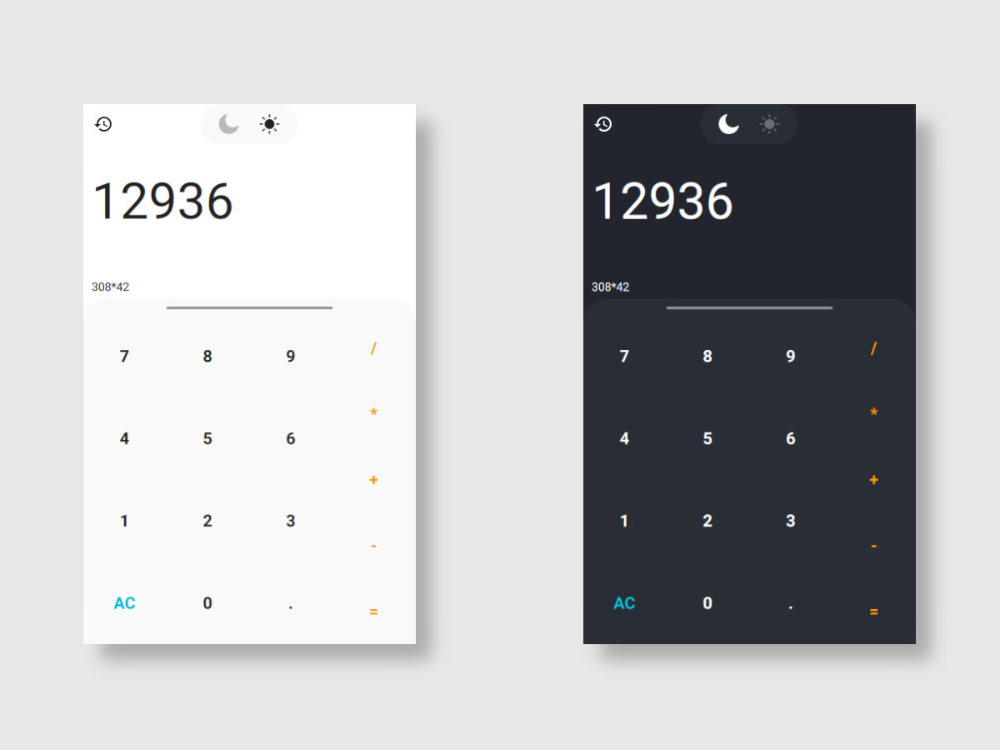

# QML-calculator
A simple calculator based on [Qt SCXML Calculator QML Example
]([https://link](https://doc.qt.io/archives/qt-6.1/qtscxml-calculator-qml-example.html))

----------
UI Designd by [Lucia Scott - Calculator](https://dribbble.com/shots/14709020-Calculator).

----------

